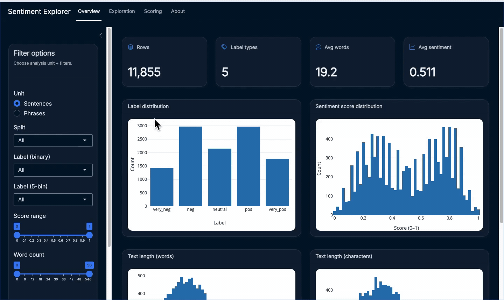
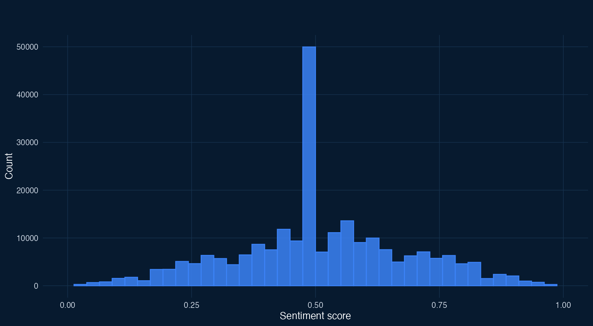

# Sentiment Analysis (R + Shiny + Plumber + tidymodels)

<p align="center">
  
</p>


**Sentiment Analysis Stack** is a production-style, end-to-end sentiment analysis project that pairs:

- **A clean, user-friendly Shiny dashboard** for exploring the Stanford Sentiment Treebank (SST) and scoring text.
- **A Plumber backend** that serves a serialized **tidymodels** bundle (`model.rds`) for consistent, repeatable scoring.
- **Training artifacts** (reports + plots) saved alongside the model so evaluation is not an afterthought.

---

## Dataset snapshot (SST / Treebank)

A quick, analyst-style summary of the dataset used in this project:

1. **Two complementary views of sentiment**
   - *Sentences* (human-readable utterances) and *phrases* (fine-grained fragments) let you analyze sentiment at different granularities.

2. **Broad coverage of text length and structure**
   - The corpus includes short fragments through longer sentences, which is useful for stress-testing robustness (very short text is often hardest to score reliably).

3. **Labels are inherently “soft”**
   - Sentiment is represented on a continuous scale in the source data and often binned into classes (binary or 5-class). Borderline examples are expected—uncertainty is a feature of the dataset, not a bug.

<p align="center">
  
</p>

> **Plot:** Sentiment score distribution (with optional binning overlays).  

---

## Why this project matters

Most “demo ML apps” fail in the same places: inconsistent preprocessing between training and serving, unclear label semantics, and no reproducible evaluation trail.

This project aims to be the opposite:

- **One pipeline, everywhere**: the same recipe/feature steps used in training are embedded in the saved bundle and reused at scoring time.
- **Clear contract**: the model bundle defines expected inputs and output schema (labels, scores), so downstream code stays stable.
- **Evaluation-first**: model training produces metrics + plots that travel with the model and can be reviewed alongside the UI.
- **Separation of concerns**: data exploration and scoring UX live in Shiny; model execution and versioning live in the backend.

---

## Architecture

```text
          ┌──────────────────────────────┐
          │        Shiny Frontend        │
          │  Overview • Exploration      │
          │  + text scoring UI           │
          └──────────────┬───────────────┘
                         │
                         │ (HTTP JSON)
                         ▼
          ┌──────────────────────────────┐
          │        Plumber Backend        │
          │  /health • /meta • scoring    │
          │  loads backend/api/model.rds  │
          └──────────────┬───────────────┘
                         │
                         ▼
          ┌──────────────────────────────┐
          │   Training + Artifacts        │
          │   reports/ (metrics + plots)  │
          │   model.rds (tidymodels)      │
          └──────────────────────────────┘

      Data: data/sst_treebank.rds (+ optional db scripts in postgresql/)
````

---

## Features

### Dashboard (Shiny)

* **Overview**: label distribution, score distribution, length distributions, KPI cards, filtering by unit/split/label/score range.
* **Exploration**: interactive scatter (score vs length), split breakdown, preview table.
* **Scoring**: load a model bundle and score input text with a friendly UI (no “API jargon” needed).
* **Downloads**: export filtered data to CSV for analysis.

### Backend (Plumber + tidymodels)

* Loads a **saved model bundle** (`model.rds`) that contains:

  * the fitted model/workflow
  * preprocessing recipe / tokenization steps
  * output schema (label levels) and optional threshold metadata
* Serves metadata and scoring in a stable, testable interface.

### Reports

* Training saves **metrics + plots** under `backend/reports/` so you can inspect performance without rerunning notebooks.

---

## Repository layout

```text
sentiment/
  backend/
    api/
      Dockerfile
      model.rds
      ... (plumber entry + training code)
    reports/
      ... (metrics + plots)
    run-docker/

  data/
    eda/
    input-data/
    sst_treebank.rds

  frontend/
    app.R
    Dockerfile
    requirements
    test-frontend.R
    R/
      about.R
      ... (other UI modules)

  media/
    demo.gif

  postgresql/
    00-create-db-steps
    01-load-sst-db.R
    02-create-schema.sql
    03-grant-schema.sql

  docker-compose.yml
```

---

## Getting started (local)

### Prerequisites

* **R** ≥ 4.3
* Recommended: **RStudio**
* Optional: **Docker + docker-compose**

### 1) Run the backend

From `backend/api/`, start the Plumber service (exact script name may vary in your repo):

```r
# backend/api
# source("main.R") or equivalent plumber entry
# pr$run(host = "0.0.0.0", port = 8000)
```

### 2) Run the frontend

From `frontend/`:

```r
setwd("frontend")
shiny::runApp(".", host = "0.0.0.0", port = 8501)
```

Then open:

* Frontend: `http://127.0.0.1:8501`

---

## Run with Docker Compose

From repo root:

```sh
docker compose up --build
```

Expected services:

* `backend` on `:8000`
* `frontend` on `:8501`

> If you’re running locally without Docker, keep backend base URL as `http://127.0.0.1:8000`.

---

## Machine learning behind the scenes

This repo is intentionally built around a few production-grade ideas:

1. **A saved bundle, not just a model**

   * The deployable artifact is `model.rds`, which includes preprocessing + model + schema metadata.
   * That means you don’t “recreate features” in the UI or API; you reuse the same pipeline.

2. **Schema-driven outputs**

   * The bundle advertises label levels (binary or multi-class), so the UI and backend can render consistently.
   * Thresholding is treated as a first-class concept (when applicable), not a hidden constant.

3. **Artifacts travel with the model**

   * Reports/plots in `backend/reports/` are generated at training time and kept for review.
   * This supports practical workflows like “promote a model version only when artifacts look good.”

4. **UI stays user-friendly**

   * The frontend avoids exposing internal endpoint names or ML plumbing.
   * Users see “score text”, distributions, and explainable outputs (label + confidence).

---

## Common issues

* **Nothing loads / empty charts**

  * Confirm `data/sst_treebank.rds` exists (or update the default path in `frontend/app.R`).
* **Model won’t load**

  * Ensure `backend/api/model.rds` exists and matches the expected bundle structure (has a scoring function / workflow + schema).
* **Docker networking**

  * Inside compose, services must refer to each other by service name (e.g., `http://backend:8000`), not `127.0.0.1`.

---

## Roadmap

* Add lightweight model cards (data source, evaluation summary, known limitations).
* Add batch scoring UX (CSV upload + download scored results) once stability is locked in.
* Optional: add database-backed exploration using the `postgresql/` scripts.

---

### Built with

* R, Shiny, bslib (Bootstrap 5)
* tidymodels (workflows, recipes, parsnip)
* Plumber
* plotly, DT, dplyr, stringr
* Docker / docker-compose

